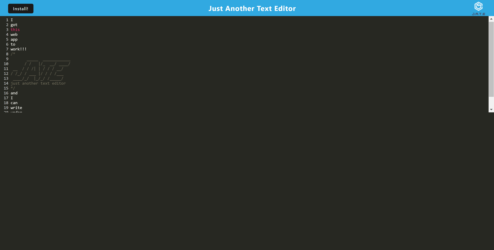
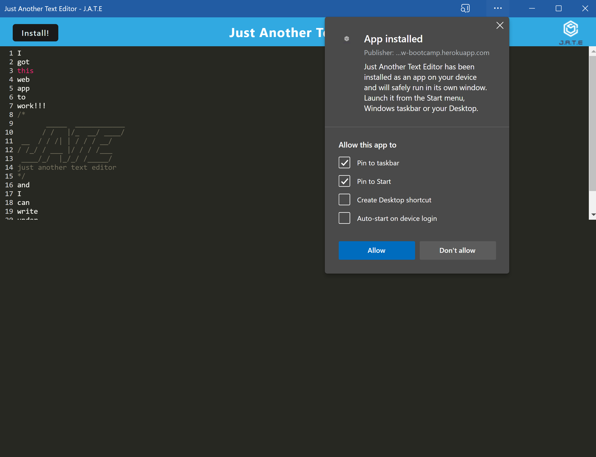

# Just Another Text Editor PWA

## Description 
A text editor application that the user can install as a web app.

Deployed Page: https://jate-ss-uw-bootcamp.herokuapp.com/

## Table of Contents
* [Description](#description)
* [Instillation](#instillation)
* [Usage](#usage)
* [Contribution](#contribution)
* [Tests](#tests)
* [Questions](#questions)
## Instillation 
On the application window there is a button that the user can click with the word install. That will install the application as a web app onto the user's device.
## Usage 
A user can write/type on the application. The line number can be seen to the left, and there is an example of some of the type art that can be done (the header) which can also be erased if the user wants.

    
## Contribution
There are no contribution guidelines for this project
## Tests
There are no tests for this application

## Liscense
This is free and unencumbered software released into the public domain. Anyone is free to copy, modify, publish, use, compile, sell, or distribute this software, either in source code form or as a compiled binary, for any purpose, commercial or non-commercial, and by any means. In jurisdictions that recognize copyright laws, the author or authors of this software dedicate any and all copyright interest in the software to the public domain. We make this dedication for the benefit of the public at large and to the detriment of our heirs and successors. We intend this dedication to be an overt act of relinquishment in perpetuity of all present and future rights to this software under copyright law. THE SOFTWARE IS PROVIDED 'AS IS', WITHOUT WARRANTY OF ANY KIND, EXPRESS OR IMPLIED, INCLUDING BUT NOT LIMITED TO THE WARRANTIES OF MERCHANTABILITY, FITNESS FOR A PARTICULAR PURPOSE AND NONINFRINGEMENT. IN NO EVENT SHALL THE AUTHORS BE LIABLE FOR ANY CLAIM, DAMAGES OR OTHER LIABILITY, WHETHER IN AN ACTION OF CONTRACT, TORT OR OTHERWISE, ARISING FROM, OUT OF OR IN CONNECTION WITH THE SOFTWARE OR THE USE OR OTHER DEALINGS IN THE SOFTWARE. For more information, please refer to https://unlicense.org

https://unlicense.org/

## Questions
If you have any further questions contact me here:
 - Email simona.snapk@gmail.com
 - GitHub [SimonaSnap](https://github.com/SimonaSnap)
